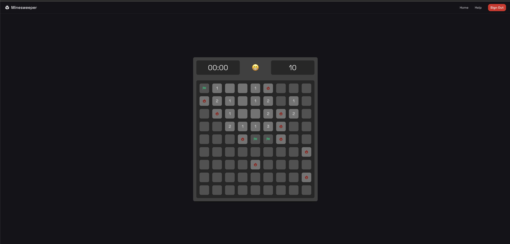

# Minesweeper!

The classic game with a modern experience. Built with React for the frontend and Django/Python for the backend

# Getting Started

### Dependencies
* Git
* Python
* Node.js
* Mac, Windows, or Linux (tested on Mac)

### Installing
* Clone the repo onto your machine
* Create a Python enviroment using `python3 -m env` in the project root
* `cd` into the `frontend` folder and run `npm install`
* `cd` into the `backend` folder and run `python3 -m pip install -r requirements.txt`

### Running the project
* In the `backend` folder, run `python3 manage.py runserver`
* In the `frontend` folder, run `npm run dev`

### Tech Design

Check out the tech design [here](./tech_design.pdf)
